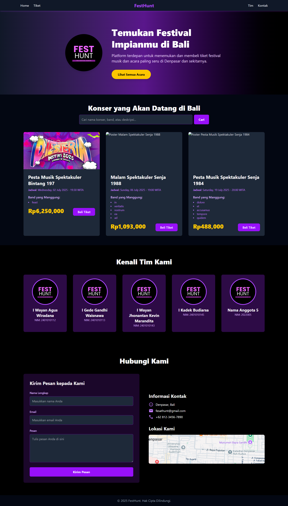
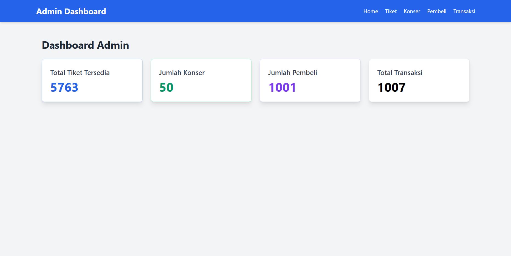
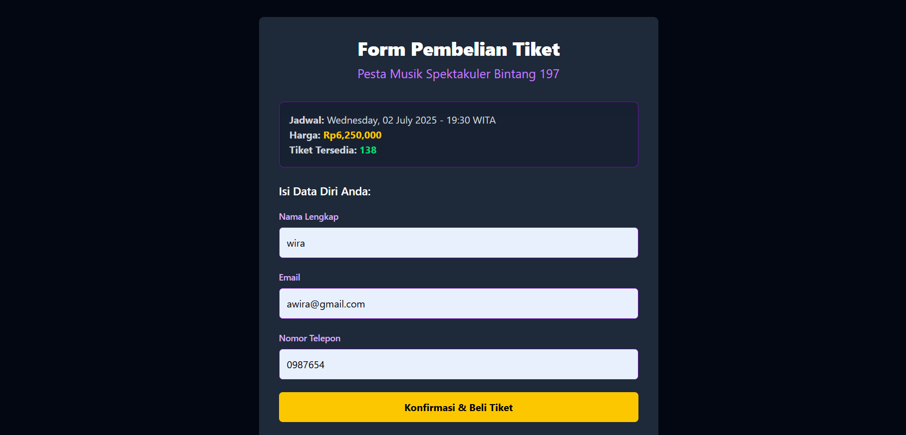
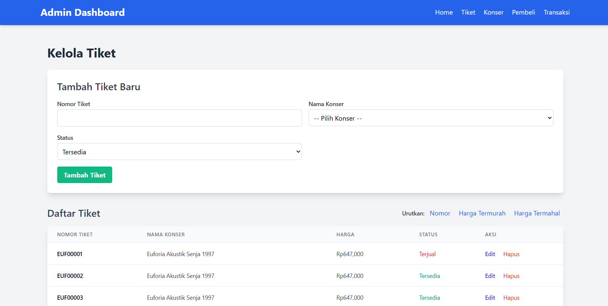
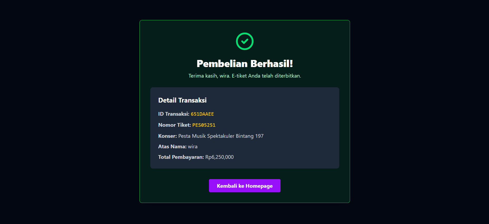
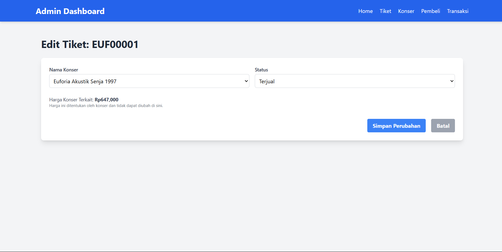
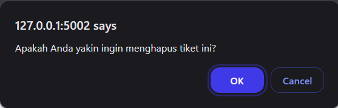

# Fest Hunt

> Sistem penjualan tiket konser berbasis pemesanan online melaliu website.

Aplikasi ini dibuat untuk memenuhi tugas Mata Kuliah Struktur Data.

---

### Daftar Isi

- Tentang Proyek
- Fitur Utama
- Tangkapan Layar
- Teknologi yang Digunakan
- Cara Menjalankan Proyek
- Kredit

---

## Tentang Proyek

Fest Hunt adalah sistem penjualan tiket konser berbasis pemesanan online melaliu website, bertujuan untuk membantu penjualan tiket tiket konser bagi yang memerlukan saya atau perantara pejualan tiket

---

## Fitur Utama

Berikut adalah fungsi dan fitur-fitur utama yang ada di dalam aplikasi ini:

- **Array:**
  - List.
  - Set.
  - Dictionary.
- ## **LinkedList:**
- **Search:**
  - Linear Search
- **Sort:**
  - Merge Sort

---

## Tangkapan Layar (Screenshot)

Berikut adalah beberapa tampilan dari aplikasi yang telah dibuat:

|                           Halaman Home                            |                   Halaman Dashboard                    |
| :---------------------------------------------------------------: | :----------------------------------------------------: |
|                         |  |
|     |         |
|  |    |
|                                                                   |    |

**Note:** Untuk tampilan halaman untuk CRUD yang lain kurang lebih sama

---

## Teknologi yang Digunakan

Proyek ini dibangun menggunakan beberapa teknologi, antara lain:

- **Frontend:** Flask Framework, Html, Tailwind CSS (CDN), JS
- **Backend:** Python
- **Database:** MySQL

---

## Kredit

Proyek ini disusun dan dikembangkan oleh:

| Nama Mahasiswa                 | NIM          | Username Github    |
| ------------------------------ | ------------ | ------------------ |
| **I Wayan Agus Wiradana**      | `2401010112` | **yanguswiradana** |
| **I Gede Gandhi Waisnawa**     | `2401010113` | **gandhibuahaha**  |
| **I Jhonatan Kevin Marandita** | `2401010143` | **dhsau**          |
| **I Kadek Budiarsa**           | `2401010145` | **Budi05986**      |
| **I Made Mahendra**            | `2401010149` | **duvtt**          |

 

**Dosen Pengampu Mata Kuliah:**

**Ida Bagus Ary Indra Iswara, S.Kom., M.Kom.**

---
